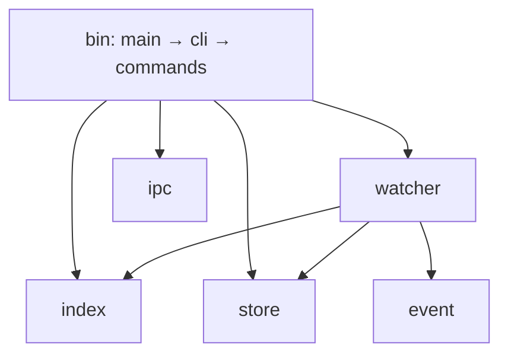

# Code Review Report

**Generated:** 2026-03-15T10:34:30-04:00
**Reviewed:** src/ (full project)
**Strategy:** full
**Tool:** reviewsmith v1.11.0

## Executive Summary

- Total: 42 functions, 9 files, 2 modules (lib + bin)
- Production lines: ~880 (test lines: ~809)
- Assessment: **Needs work** — no critical issues, but several medium-severity correctness gaps
- Critical issues: 0
- High issues: 0
- Medium issues: 7
- Low issues: 6
- Confidence: High

## Findings by Severity

### Critical

None.

### High

None.

### Medium

1. **src/watcher.rs:264 `is_ignored`** — Passes absolute paths to gitignore matcher while the test helper `is_ignored_by` uses relative paths. This inconsistency suggests production matching may fail for certain gitignore patterns.
   - **Impact:** Files that should be ignored may be tracked, or vice versa.
   - **Recommendation:** Strip root prefix before passing to the gitignore matcher, matching the test helper approach.

2. **src/watcher.rs:56 `baseline_snapshot`** — A single unreadable file during baseline aborts the entire watcher startup via `?` on `fs::read`. Should log and skip to be resilient against permission-denied files.
   - **Impact:** Watcher fails to start if any file in the project is unreadable.
   - **Recommendation:** Log the error with `eprintln!` and `continue` instead of `?`.

3. **src/watcher.rs:155 `build_event`** — Three concerns: (a) double `metadata()` call is a TOCTOU issue, (b) `Diff.patch` is always `String::new()` — the field exists but is never populated, making the `Diff` struct misleading, (c) `let _ = self.index.append(...)` silently discards index write errors, risking silent data loss.
   - **Impact:** Misleading API surface; potential silent data loss on index write failure.
   - **Recommendation:** Cache metadata result; resolve Diff.patch (implement or remove); at minimum `eprintln!` on index append errors.

4. **src/watcher.rs:99 `next_event`** — Notify errors cause permanent iterator termination. Only the first path from multi-path events is captured, so rename events lose their source/destination pairing.
   - **Impact:** Transient FS notification errors kill the watcher permanently; renames are partially tracked.
   - **Recommendation:** Log and continue on transient errors; capture all paths from multi-path events.

5. **src/index.rs:42 `read_all`** — Silently skips malformed JSONL lines. This masks data corruption.
   - **Impact:** Corrupted index entries are invisible to the user.
   - **Recommendation:** Log or return a count of skipped entries.

6. **src/index.rs:71 `state_at`** — HashMap insert overwrites unconditionally, relying on chronological file order for correctness. If entries are ever written out of order (clock skew, concurrent writers), this silently returns wrong results.
   - **Impact:** Incorrect point-in-time restore if index entries are not chronologically ordered.
   - **Recommendation:** Compare timestamps before replacing in the HashMap.

7. **src/bin/lhi/commands.rs:70 `restore`** — Single-file restore (`--file`) doesn't handle the deletion case. If a file didn't exist at the cutoff time, it should be deleted, but the file filter only looks at `state_at` results and misses this.
   - **Impact:** Restoring a single file that was created after the cutoff leaves it in place instead of deleting it.
   - **Recommendation:** Check if the file existed at cutoff; if not, delete it.

### Low

1. **src/bin/lhi/commands.rs:221 `parse_before`** — `and_local_timezone(Local).unwrap()` can panic during DST transitions. Use `.earliest().ok_or(...)` instead.

2. **src/bin/lhi/commands.rs:139 `snapshot`** — Each file gets a different `Utc::now()` timestamp rather than a single consistent snapshot time.

3. **src/bin/lhi/commands.rs:33 `log`** — Text output format `{:<8}` truncates event types longer than 8 characters.

4. **src/store.rs:35 `blob_path`** — Flat directory layout will degrade with filesystem performance at scale. Git-style 2-char prefix sharding is the standard fix.

5. **src/watcher.rs:282 `hex_sha256`** — Dead code in production. Duplicated from `store.rs`. Compiler already warns about it.

6. **src/index.rs:95 `compact`** — No advisory locking. Concurrent `append` during `compact` can lose the appended entry.

## Function-Level Analysis

- Functions reviewed: 42
- Common patterns: content-addressable storage, JSONL append-only log, debounced FS events, Unix socket IPC
- Common issues: silent error discarding, full-index scans, duplicated utility code

### event.rs (1 function)

| Function | Line | Severity | Assessment |
|---|---|---|---|
| `default_true` | 20 | ✅ none | Standard serde default pattern |

### store.rs (6 functions)

| Function | Line | Severity | Assessment |
|---|---|---|---|
| `BlobStore::init` | 12 | ✅ none | Idempotent dir creation |
| `store_blob` | 19 | ✅ none | Content-addressable with dedup. Minor TOCTOU acceptable for single-user CLI |
| `read_blob` | 27 | ✅ none | Clean delegation to fs::read |
| `has_blob` | 31 | ✅ none | Simple exists check |
| `blob_path` | 35 | ⚠️ medium | Flat directory layout degrades at scale |
| `hex_sha256` | 40 | ✅ none | Standard sha2 usage |

### index.rs (8 functions)

| Function | Line | Severity | Assessment |
|---|---|---|---|
| `Index::open` | 25 | ✅ none | Clean |
| `Index::append` | 32 | ✅ none | Opens file per call — minor overhead but correct |
| `Index::read_all` | 42 | ⚠️ medium | Silently skips malformed JSONL lines |
| `Index::query_file` | 55 | ✅ none | Full scan — fine for CLI scale |
| `Index::query_since` | 63 | ✅ none | Full scan — fine for CLI scale |
| `Index::state_at` | 71 | ⚠️ medium | Relies on chronological order for last-write-wins |
| `Index::all_known_paths` | 87 | ✅ none | Clean |
| `Index::compact` | 95 | ⚠️ low | No concurrency protection during rewrite |

### watcher.rs (9 functions)

| Function | Line | Severity | Assessment |
|---|---|---|---|
| `LhiWatcher::new` | 30 | ⚠️ medium | Baseline failure aborts startup |
| `baseline_snapshot` | 56 | ⚠️ medium | Single read failure aborts all; platform-fragile .lhi check |
| `get_file_mode` (unix) | 89 | ✅ none | Clean |
| `get_file_mode` (non-unix) | 95 | ✅ none | Clean |
| `next_event` | 99 | ⚠️ medium | Notify errors terminate permanently |
| `flush_ready` | 140 | ✅ none | Non-deterministic order fine for debounce |
| `build_event` | 155 | ⚠️ medium | Double metadata; empty Diff.patch; silent index errors |
| `is_ignored` | 264 | ⚠️ medium | Absolute vs relative path inconsistency |
| `hex_sha256` | 282 | ⚠️ low | Dead code, duplicated from store.rs |

### ipc.rs (4 functions)

| Function | Line | Severity | Assessment |
|---|---|---|---|
| `Broadcaster::start` | 15 | ⚠️ low | Accept thread has no shutdown mechanism |
| `Broadcaster::broadcast` | 39 | ✅ none | Correct retain_mut pruning |
| `Broadcaster::sock_path` | 51 | ✅ none | Clean |
| `Broadcaster::drop` | 56 | ✅ none | Cleans up socket file |

### bin — main.rs, cli.rs, commands.rs (14 functions)

| Function | Line | Severity | Assessment |
|---|---|---|---|
| `main` | main.rs:3 | ✅ none | Clean error handling |
| `cli::run` | cli.rs:66 | ✅ none | Clean dispatch |
| `commands::watch` | 13 | ✅ none | Serialization error terminates loop (minor) |
| `commands::log` | 33 | ⚠️ low | Column width may truncate "snapshot" |
| `commands::cat` | 63 | ✅ none | Minimal and correct |
| `commands::restore` | 70 | ⚠️ medium | Single-file restore misses deletion case |
| `commands::snapshot` | 139 | ⚠️ low | Per-file timestamps instead of single snapshot time |
| `commands::compact` | 170 | ✅ none | Clean delegation |
| `get_file_mode` (unix) | 181 | ✅ none | Clean |
| `get_file_mode` (non-unix) | 187 | ✅ none | Clean |
| `to_restore_action` | 198 | ✅ none | Reads full file for hash — bounded by MAX_FILE_SIZE |
| `parse_since` | 219 | ✅ none | Clean delegation |
| `parse_before` | 221 | ⚠️ low | unwrap() can panic during DST transitions |
| `parse_duration_ago` | 232 | ✅ none | Good unit coverage |

## File-Level Analysis

- Files reviewed: 9
- Cohesion: Excellent across all modules except `watcher.rs` (does too much)
- Coupling: `watcher.rs` is the coupling hotspot (depends on store, index, event, ignore, notify, sha2)
- Design patterns: Content-addressable storage, append-only log, debounced event stream

| File | Functions | Cohesion | Coupling | Notes |
|---|---|---|---|---|
| event.rs | 1 | High | None | Pure data types |
| store.rs | 6 | High | Low (sha2) | Single responsibility |
| index.rs | 8 | High | Low (serde, chrono) | Single responsibility |
| watcher.rs | 9 | Low | High (store, index, event, notify, ignore, sha2) | God module — watching, debouncing, storage, indexing, diffing |
| ipc.rs | 4 | High | Low (std::os::unix) | Single responsibility, Unix-only |
| main.rs | 1 | High | Low (cli) | Entry point |
| cli.rs | 1 | High | Low (clap, commands) | CLI definition |
| commands.rs | 12 | Medium | High (watcher, ipc, store, index, ignore, sha2, chrono) | Expected for orchestration layer |

## Module-Level Analysis

- Modules: 2 (lib crate, bin crate)
- Circular dependencies: None
- Boundary clarity: Good



## Architectural Analysis

- Architecture type: Layered CLI application

```
┌─────────────────────────────────┐
│  bin (main → cli → commands)    │  Presentation / Orchestration
├─────────────────────────────────┤
│  watcher        ipc             │  Runtime services
├─────────────────────────────────┤
│  index          store           │  Persistence
├─────────────────────────────────┤
│  event                          │  Shared data types
└─────────────────────────────────┘
```

### Strengths
- Clean module boundaries — store, index, event, ipc are fully independent of each other
- Content-addressable storage with deduplication is a solid design choice
- Good test coverage across all modules with realistic integration tests
- JSONL index is simple, append-only, and human-readable
- Debounce logic in the watcher is well-structured
- Platform-conditional compilation for Unix file modes handled correctly
- The `ignore` crate integration respects .gitignore rules out of the box

### Weaknesses
- `watcher.rs` is a god module — owns FS watching, debouncing, blob storage, index writing, diff tracking, and baseline snapshots
- `Diff.patch` is always empty — the struct field and serialization exist but no actual diff content is ever generated
- No graceful error recovery in the watcher — one bad file or one notify error stops everything
- Unix-only IPC (UnixListener/UnixStream) — ipc module won't compile on Windows
- `hex_sha256` duplicated between store.rs and watcher.rs
- No file locking on the index — concurrent watch + compact or watch + snapshot can corrupt data

### Missing Components
- No `lhi diff` command to show actual content differences between versions
- No `lhi status` command to show current tracking state
- No index pruning by age (only compact by file)

## Recommendations (Prioritized)

### Immediate (fix before relying on restore)

1. **Fix `parse_before` DST panic** — Replace `.unwrap()` with `.earliest().ok_or(...)` to prevent runtime panics on valid user input
2. **Fix single-file restore deletion gap** — When restoring with `--file`, check if the file existed at cutoff and delete if not

### Short-Term

3. **Make `is_ignored` use relative paths** — Strip root prefix before passing to gitignore matcher
4. **Make `baseline_snapshot` resilient** — Log and skip unreadable files instead of aborting
5. **Don't silently discard index append errors in `build_event`** — At minimum `eprintln!` the error
6. **Resolve `Diff.patch`** — Either implement actual diff generation or remove the `patch` field
7. **Deduplicate `hex_sha256`** — Move to `store.rs` as `pub` or a shared `util` module

### Long-Term

8. **Split `watcher.rs`** — Extract debounce logic and baseline snapshot into separate concerns
9. **Add advisory file locking to `Index`** — Protect against concurrent compact + append data loss
10. **Consider blob sharding** — Git-style `ab/cd1234...` directory structure for scale

## Human Comprehension Assessment

- **Can you explain how the system works?** Yes
- **Would you trust this in production?** With changes (items 1-2)
- **Could you modify it safely?** Yes — clean module boundaries make targeted changes straightforward
- **Confidence in understanding:** High

**Explain to a junior developer:**
lhi is a local history tool for code — think "undo" for your whole project. When you run `lhi watch`, it monitors your files for changes using OS file system notifications. Every time a file changes, it stores a copy of the content in a content-addressable blob store (like git objects) and appends a timestamped entry to a JSONL index file. You can then use `lhi log` to see what changed, `lhi cat` to view old versions, and `lhi restore --before 5m` to roll back files to how they looked 5 minutes ago. It also broadcasts change events over a Unix socket so other tools can listen in real-time.

## Next Steps

1. Fix the two immediate items (DST panic, single-file restore deletion)
2. Address the `is_ignored` path inconsistency — this could cause real missed/extra tracking
3. Make the watcher resilient to individual file read failures
4. Decide on the `Diff.patch` field — implement or remove
